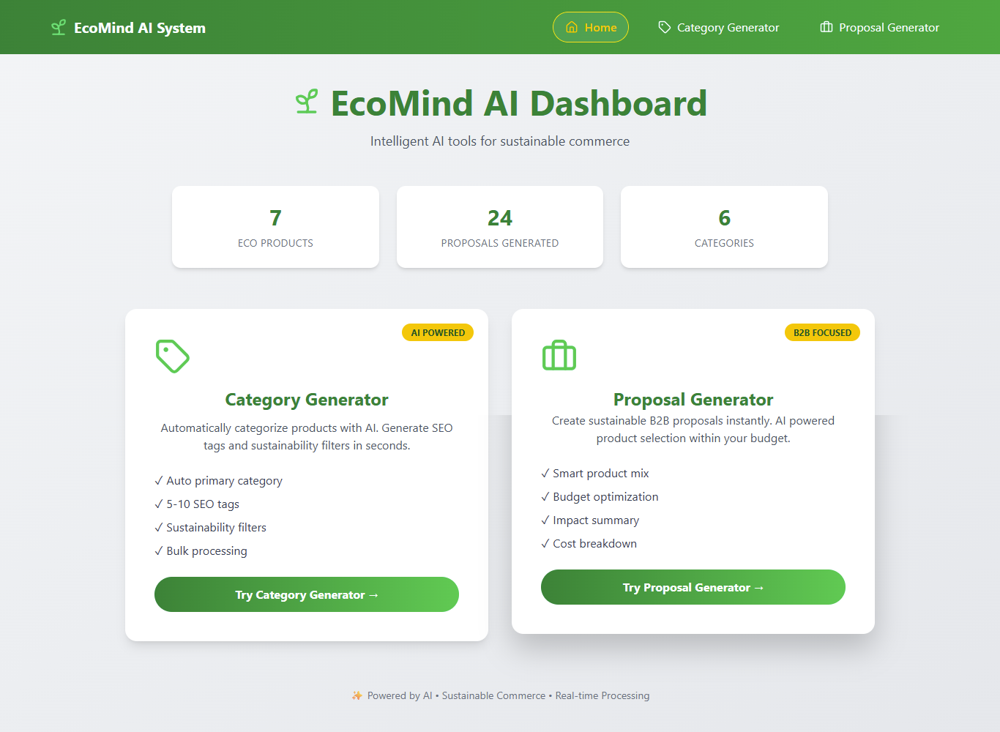
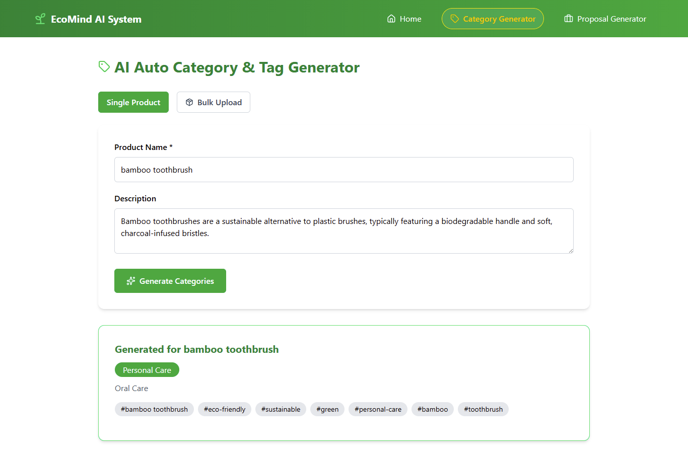
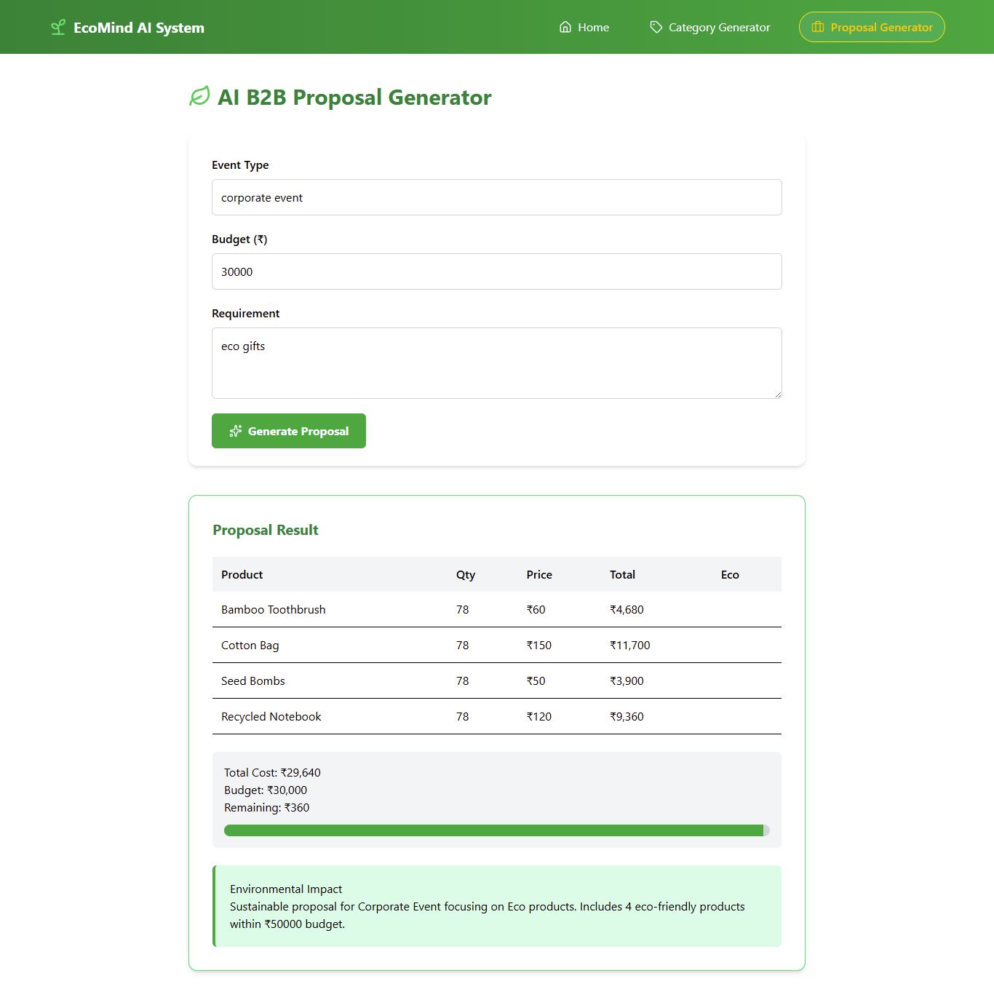

# 🌱 Sustainable-Commerce Platform

<div align="center">


**AI-Powered Tools for Sustainable E-Commerce**

[Features](#✨-features) • [Tech Stack](#🛠️-tech-stack) • [Installation](#🚀-installation) • [API Docs](#📡-api-endpoints) • [Demo](#🎥-demo)

</div>

---

## 📋 **Table of Contents**
- [Overview](#-overview)
- [✨ Features](#✨-features)
- [🛠️ Tech Stack](#🛠️-tech-stack)
- [📁 Project Structure](#📁-project-structure)
- [🚀 Installation](#🚀-installation)
- [⚙️ Configuration](#⚙️-configuration)
- [📡 API Endpoints](#📡-api-endpoints)
- [💾 Database Schema](#💾-database-schema)
- [🎯 Module 1: Category Generator](#🎯-module-1-auto-category--tag-generator)
- [💼 Module 2: B2B Proposal Generator](#💼-module-2-b2b-proposal-generator)
- [🧪 Testing](#🧪-testing)
- [🎥 Demo Video](#🎥-demo-video)
- [👨‍💻 Contributing](#👨‍💻-contributing)
- [📄 License](#📄-license)

---

## 📖 **Overview**

Rayeva AI System is a powerful backend platform that leverages artificial intelligence to automate sustainable commerce operations. Built for the Rayeva AI Systems Assignment, this project demonstrates the integration of AI with real business logic to create production-ready solutions.

### **Why Rayeva AI?**
- 🤖 **AI-Powered** - Uses Llama 3.1 for intelligent decision making
- 🌱 **Sustainability Focused** - Built for eco-friendly businesses
- 🏗️ **Clean Architecture** - Separation of concerns, easy to maintain
- 📊 **Data Persistence** - All interactions logged in MongoDB
- 🔒 **Production Ready** - Error handling, validation, environment configs

---

## ✨ **Features**

### ✅ **Completed Modules**

#### **Module 1: Auto-Category & Tag Generator** 🏷️
- Automatically assigns primary categories from predefined list
- Suggests relevant sub-categories
- Generates 5-10 SEO-optimized tags
- Identifies sustainability filters (plastic-free, vegan, recycled, etc.)
- Bulk processing for multiple products
- Confidence scoring and AI reasoning
- URL slug generation

#### **Module 2: B2B Proposal Generator** 💼
- Creates sustainable product mixes within budget
- Intelligent product selection based on event type
- Real-time cost calculation and budget management
- Environmental impact summary
- Automatic scaling when over budget
- Smart fallback system for unmatched products

### **System Features**
- ✅ Structured JSON outputs for all endpoints
- ✅ Prompt + response logging in MongoDB
- ✅ Environment-based configuration
- ✅ Clean separation of AI and business logic
- ✅ Comprehensive error handling
- ✅ Input validation
- ✅ 17+ eco-friendly products in database
- ✅ 4+ category generation logs

---

# 🛠️ **Tech Stack**

| Frontend | Backend | Database | AI |
|----------|---------|----------|-----|
| React.js | Node.js | MongoDB | OpenRouter (Llama 3.1) |
| Axios | Express | Mongoose | - |

---

### **Development Tools**
| Tool | Purpose |
|------|---------|
| **dotenv** | Environment variables |
| **cors** | Cross-origin resource sharing |
| **axios** | HTTP requests to AI service |
| **nodemon** | Development auto-restart |
| **MongoDB Compass** | Database GUI |

## 🖼️ Preview





## ⚙️ **Installation**

### Backend Setup
```bash
# Clone repo
git clone https://github.com/yourusername/rayeva-ai-system.git
cd rayeva-ai-system/backend

# Install dependencies
npm install express mongoose cors dotenv axios

# Create .env file
echo "PORT=9000
MONGO_URI=mongodb://127.0.0.1:27017/rayeva-ai
OPENROUTER_API_KEY=your-key-here" > .env

# Start MongoDB
mongodb

# Seed database (optional)
node seed.js

# Run server
npm run dev
```

# 👨‍💻 Author
### HALIMUNNISA SHAIK

GitHub: https://github.com/Halimunnisa0127

LinkedIn: https://www.linkedin.com/in/halimunnisa-shaik-dev/


